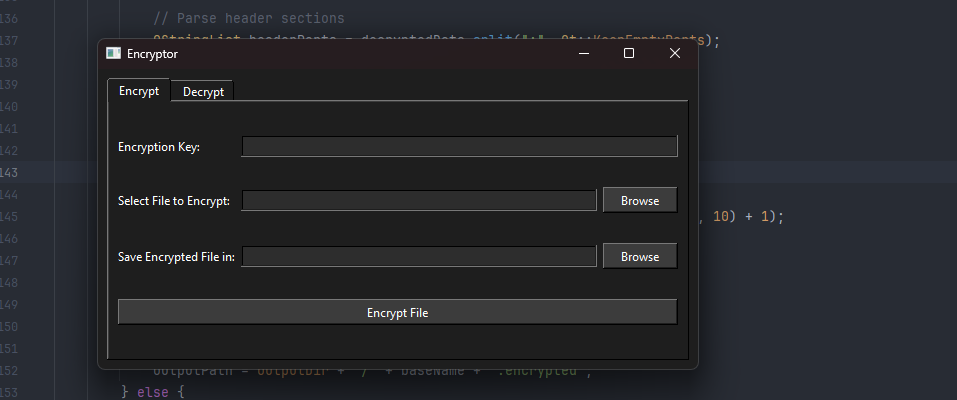

I made a little file encryptor because I was bored.
I also wanted to learn more C++
Feel free too use it.

It deletes the original file and when encrypting and when decrypting it restores the orignal file.

I used Qt to help create. I should have used imgui.